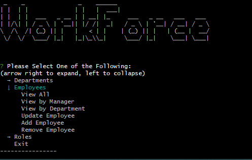
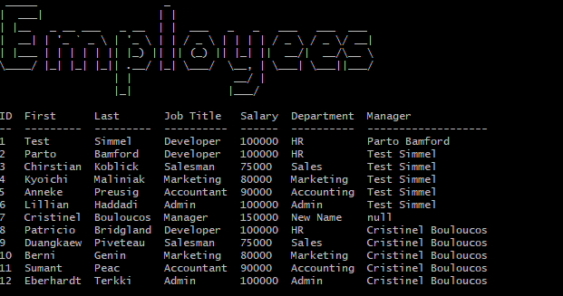
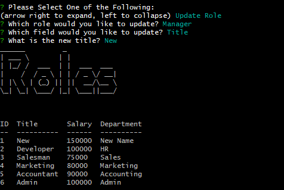

# WorkForce

## Description

View and update employee, department, and job information from your terminal

## Table of Contents

- [WorkForce](#workforce)
  - [Description](#description)
  - [Table of Contents](#table-of-contents)
  - [Installation](#installation)
  - [Usage](#usage)
  - [Video](#video)
  - [Images](#images)
    - [Image 1](#image-1)
    - [Image 2](#image-2)
    - [Image 3](#image-3)
  - [Questions](#questions)

## Installation

1. Clone repo.
2. Run npm i

## Usage

To use this appliction: 
  1. Start the server with "node server.js"
  2. In a different terminal, start the application with "node index.js".

## Video

[Example Video](https://www.loom.com/share/d75c4b15a40b46b7a644b43760c7fa56 "Example Video")

## Images

### Image 1

### Image 2

### Image 3

## Questions

[My GitHub Profile](https://github.com/Deejerz88)

If you have any questions about my project, please contact me at [djmcmillan93@gmail.com](mailto:djmcmillan93@gmail.com).
